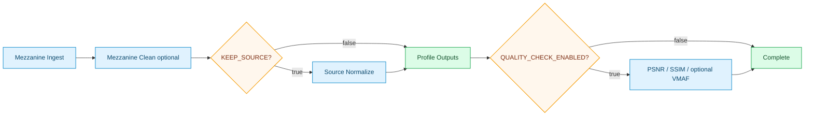
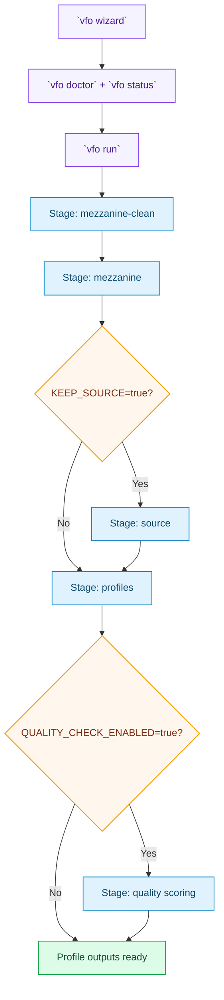

# Flow Levels

These diagrams intentionally show the same pipeline at three levels, so each audience can zoom in without losing context.

## Level 1: Executive View



## Level 2: Operator View (CLI + Stages)



## Level 3: Engine View (Status Keys)

```mermaid
flowchart TD
  classDef status fill:#e0f2fe,stroke:#0284c7,color:#0c4a6e,stroke-width:1.2px;
  classDef gate fill:#fff7ed,stroke:#f59e0b,color:#7c2d12,stroke-width:1.5px;
  classDef warn fill:#fef2f2,stroke:#dc2626,color:#7f1d1d,stroke-width:1.2px;
  classDef output fill:#dcfce7,stroke:#16a34a,color:#14532d,stroke-width:1.2px;

  E0[engine.snapshot]:::status --> C0[config.directory]:::status
  C0 --> D0[dependency.ffmpeg / ffprobe / mkvmerge / dovi_tool]:::status
  D0 --> S0[storage.mezzanine[n] / storage.source[n]]:::status
  S0 --> P0[profiles.detected + profile.*.scenarios]:::status
  P0 --> G0{stage.mezzanine ready?}:::gate
  G0 -->|No| X0[stage.execute blocked]:::warn
  G0 -->|Yes| M0[stage.mezzanine]:::status
  M0 --> G1{stage.source enabled?}:::gate
  G1 -->|Yes| SRC[stage.source]:::status
  G1 -->|No| PRF[stage.profiles]:::status
  SRC --> PRF
  PRF --> G2{stage.quality enabled?}:::gate
  G2 -->|Yes| Q0[stage.quality]:::status
  G2 -->|No| DONE[stage.execute complete]:::output
  Q0 --> DONE
```

## Reading Tip

- Use **Level 1** for stakeholder alignment.
- Use **Level 2** when operating vfo.
- Use **Level 3** when debugging CI or stage readiness.
