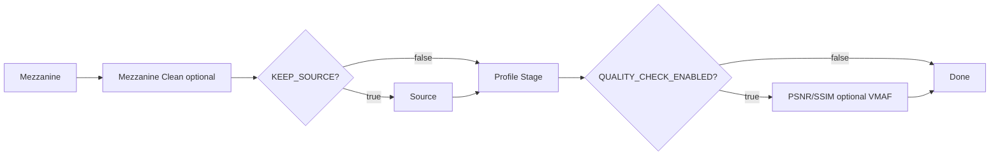

# Pipeline End To End

The default vfo pipeline is:

## What Content Can Be Accommodated?

vfo is criteria-driven, so "accommodated" means "matches at least one configured profile criteria envelope and scenario." 

For stock presets, this includes practical lanes for:

- 4K HEVC target outputs
- 1080p compatibility outputs
- subtitle-intent profile outputs (MKV when main subtitle should be preserved)
- device-oriented profiles (Roku/Fire TV/Chromecast/Apple TV families)

Use the [Capability Matrix](profile-capability-matrix.md) for exact codec/bit-depth/color/resolution envelopes.
