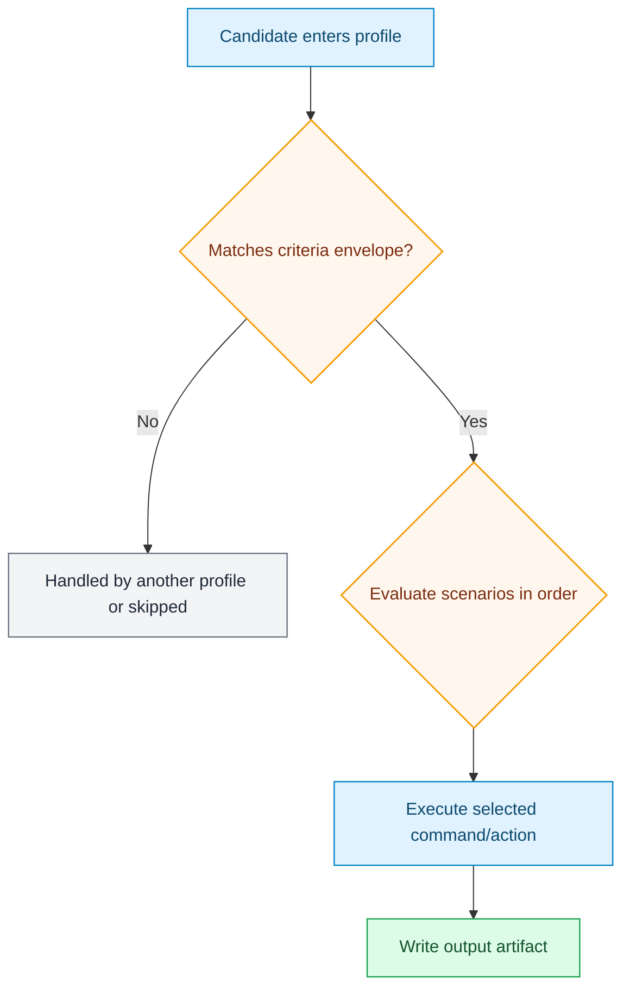

# Profile Visual Standard

Each profile info sheet should answer five things quickly:

1. Input envelope (codec, bits, color, min/max resolution)
2. Scenario map (ordered rules and commands)
3. Runtime behavior (what actually happens)
4. Output container decision path
5. Operator knobs (env vars that alter behavior)

## Standard Diagram Pattern

## Subtitle-Intent Variant

For `netflixy_main_subtitle_intent` profiles, the output container branch is explicit:

- Main subtitle found -> MKV output
- Main subtitle not found -> MP4 faststart output

This variant is now generated automatically into each subtitle-intent profile sheet.

## Where to See It

- [Stock profile info sheets](profiles/index.md)
- `netflixy` active profiles:
  - [4k subtitle-intent sheet](profiles/generated/netflixy-preserve-audio-main-subtitle-intent-4k.md)
  - [1080p subtitle-intent sheet](profiles/generated/netflixy-preserve-audio-main-subtitle-intent-1080p.md)
