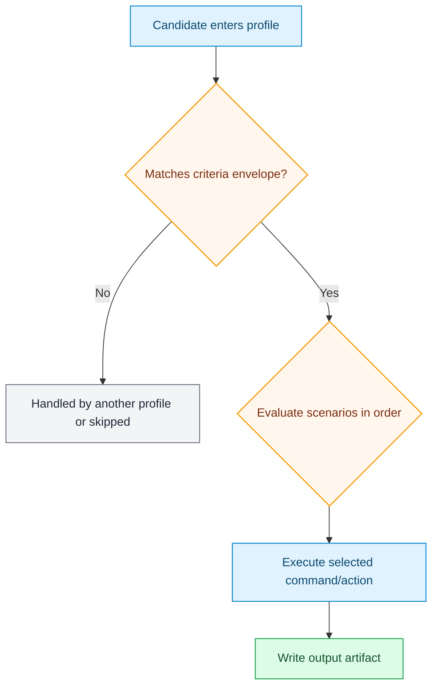

# Profile Visual Standard

Each profile info sheet should answer five things quickly:

1. Input envelope (codec, bits, color, min/max resolution)
2. Scenario map (ordered rules and commands)
3. Runtime behavior (what actually happens)
4. Output container decision path
5. Operator knobs (env vars that alter behavior)

## Standard Diagram Pattern

## Selected-Subtitle Variant

For `craigstreamy_hevc_selected_english_subtitle_preserve` and `craigstreamy_hevc_smart_eng_sub_audio_conform` profiles, the output container branch is explicit:

- Selected English subtitle found -> MKV output
- Selected English subtitle not found -> stream-ready MP4 output (fragmented + init/moov at start by default)

This variant is now generated automatically into each selected-subtitle profile sheet.

## Where to See It

- [Stock profile info sheets](profiles/index.md)
- `craigstreamy` active profiles:
  - [4k smart-eng-sub audio-conform sheet](profiles/generated/craigstreamy-hevc-smart-eng-sub-audio-conform-4k.md)
  - [1080p smart-eng-sub audio-conform sheet](profiles/generated/craigstreamy-hevc-smart-eng-sub-audio-conform-1080p.md)
  - [4k selected-subtitle sheet](profiles/generated/netflixy-preserve-audio-main-subtitle-intent-4k.md)
  - [1080p selected-subtitle sheet](profiles/generated/netflixy-preserve-audio-main-subtitle-intent-1080p.md)
