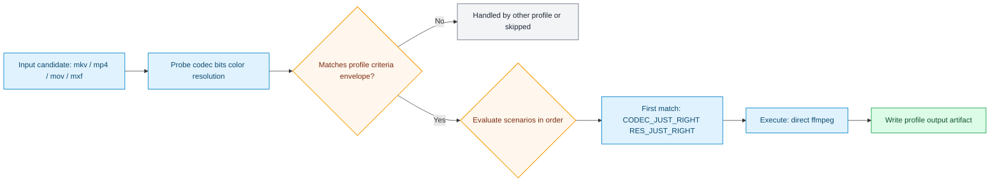

# Balanced Legacy Sub-HD Open Audio Profile

Generated from stock preset pack `balanced_open_audio`.

## Dependencies

| Tool | Needed | Why |
| --- | --- | --- |
| `ffmpeg` | required | scenario execution, encode/transcode, and mux packaging |
| `ffprobe` | required | criteria probing and stream/metadata inspection |

## E2E Verification

This profile is considered e2e-verified when its mapped suites pass in CI.

| Suite | What it proves | Toolchain version report |
| --- | --- | --- |
| `tests/e2e/run_profile_actions_e2e.sh` | action-level output behavior, guardrails, and subtitle-intent pathways | `tests/e2e/.reports/latest/run_profile_actions_e2e_toolchain_versions.md` |

- Combined toolchain snapshot: [Latest E2E Toolchain Report](../../e2e-toolchain-latest.md)

## Input Envelope

| Field | Value |
| --- | --- |
| Codec | `hevc` |
| Bit depth | `any` |
| Color space | `any` |
| Min resolution | `320x240` |
| Max resolution | `1279x719` |

## Scenario Map

| Scenario | Command |
| --- | --- |
| `CODEC_JUST_RIGHT RES_JUST_RIGHT` | `ffmpeg (inline command)` |
| `ELSE` | `transcode_hevc_legacy_all_sub_preserve_profile.sh` |

## Runtime Behavior

- Scenario `CODEC_JUST_RIGHT RES_JUST_RIGHT` uses direct ffmpeg command execution.
- Scenario `ELSE` uses action script `transcode_hevc_legacy_all_sub_preserve_profile.sh`.

## Starting Inputs And Expected Outputs

| Aspect | What this profile expects / does |
| --- | --- |
| Starting containers | `mkv, mp4, mov, mxf (anything ffmpeg can demux)` |
| Required codec envelope | `hevc` / `any-bit` / `any` |
| Required resolution range | `320x240` to `1279x719` |
| If criteria do not match | candidate is routed to another profile or skipped |
| If criteria match | scenario order is evaluated and first match executes |
| Output intent | output container and streams are defined directly by the ffmpeg command |

## Flow

## Source

- Preset file: `services/vfo/presets/balanced_open_audio/vfo_config.preset.conf`
- Generated by: `infra/scripts/generate-profile-docs.sh`
