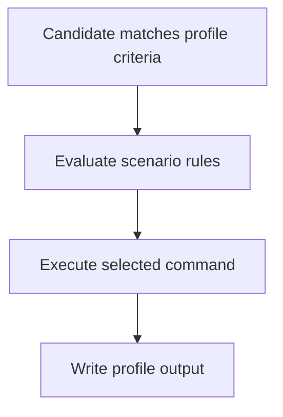

# chromecast_google_tv_4k_open_audio

Generated from stock preset pack `device_targets_open_audio`.

## Input Envelope

| Field | Value |
| --- | --- |
| Codec | `hevc` |
| Bit depth | `any` |
| Color space | `bt709` |
| Min resolution | `352x240` |
| Max resolution | `3840x2160` |

## Scenario Map

| Scenario | Command |
| --- | --- |
| `CODEC_JUST_RIGHT RES_JUST_RIGHT` | `ffmpeg -nostdin -i $vfo_input -c copy -map 0 -movflags faststart -strict -2 $vfo_output` |
| `RES_TOO_HIGH` | `transcode_hevc_4k_profile.sh $vfo_input $vfo_output` |
| `ELSE` | `transcode_hevc_4k_profile.sh $vfo_input $vfo_output` |

## Runtime Behavior

- Scenario `CODEC_JUST_RIGHT RES_JUST_RIGHT` uses direct ffmpeg command execution.
- Scenario `RES_TOO_HIGH` uses action script `transcode_hevc_4k_profile.sh`.
- Scenario `ELSE` uses action script `transcode_hevc_4k_profile.sh`.

## Flow

## Source

- Preset file: `services/vfo/presets/device_targets_open_audio/vfo_config.preset.conf`
- Generated by: `infra/scripts/generate-profile-docs.sh`
