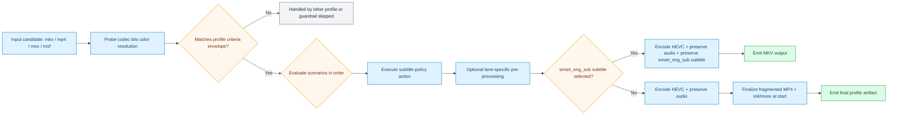

# Craigstreamy HEVC Selected English Subtitle Preserve 1080p Profile

Generated from stock preset pack `craigstreamy-hevc-selected-english-subtitle-preserve`.

This profile still uses a legacy internal config id for compatibility.

## Dependencies

| Tool | Needed | Why |
| --- | --- | --- |
| `ffmpeg` | required | scenario execution, encode/transcode, and mux packaging |
| `ffprobe` | required | criteria probing and stream/metadata inspection |

## E2E Verification

This profile is considered e2e-verified when its mapped suites pass in CI.

| Suite | What it proves | Toolchain version report |
| --- | --- | --- |
| `tests/e2e/run_profile_actions_e2e.sh` | action-level output behavior, guardrails, and subtitle-intent pathways | `tests/e2e/.reports/latest/run_profile_actions_e2e_toolchain_versions.md` |

- Combined toolchain snapshot: [Latest E2E Toolchain Report](../../e2e-toolchain-latest.md)

## Intent

Compatibility note: this profile belongs to the canonical `craigstreamy` pack family even though the current config profile id is legacy-shaped.

This profile converts candidates into streaming-friendly HEVC outputs while preserving the `smart_eng_sub + preserve` subtitle policy where feasible.

## What It Optimizes For

- practical bitrate efficiency with a consistent HEVC target
- preserve all audio streams by default when packaging permits
- subtitle policy: `smart_eng_sub` + `preserve`
- conditional container selection: MKV when the `smart_eng_sub + preserve` policy selects a subtitle, fragmented MP4 otherwise

## Input Envelope

| Field | Value |
| --- | --- |
| Codec | `any` |
| Bit depth | `any` |
| Color space | `bt709` |
| Min resolution | `1280x720` |
| Max resolution | `1920x1080` |

## Scenario Map

| Scenario | Command |
| --- | --- |
| `RES_JUST_RIGHT COLOR_SPACE_JUST_RIGHT` | `transcode_hevc_1080_main_subtitle_preserve_profile.sh` |
| `ELSE` | `profile_guardrail_skip.sh (requires SDR bt709 and 1280x720 to 1920x1080 input)` |

## Runtime Behavior

- Scenario `RES_JUST_RIGHT COLOR_SPACE_JUST_RIGHT` uses action script `transcode_hevc_1080_main_subtitle_preserve_profile.sh`.
- Scenario `ELSE` uses action script `profile_guardrail_skip.sh`.

Action summary from `transcode_hevc_1080_main_subtitle_preserve_profile.sh`:

- Always preserves audio streams with stream copy.
- Default subtitle behavior is `smart_eng_sub + preserve`.
- Policy can be overridden by wrapper packs via:
-   VFO_SUBTITLE_SELECTION_SCOPE=smart_eng_sub|all_sub_preserve
-   VFO_SUBTITLE_MODE=preserve|subtitle_convert
-   VFO_SUBTITLE_CONVERT_BITMAP_POLICY=fail|preserve_mkv
- Enforces SDR-oriented 1080 policy metadata on output (`bt709` signaling).
- `preserve` emits MKV whenever the resolved subtitle policy selects streams.
- `subtitle_convert` keeps MP4 when selected subtitles are text-convertible and
-   converts them to `mov_text`; bitmap subtitles fail by default unless
-   `VFO_SUBTITLE_CONVERT_BITMAP_POLICY=preserve_mkv`.
- If no subtitle is selected, output container is stream-ready MP4.

Operator knobs from `transcode_hevc_1080_main_subtitle_preserve_profile.sh`:

- `VFO_MAIN_SUBTITLE_INCLUDE_DEFAULT=1   # include default english subtitle when no forced track exists`
- `VFO_ENCODER_MODE=auto|hw|cpu`
- `VFO_MP4_STREAM_MODE=fmp4_faststart|fmp4|faststart`
- `default: fmp4_faststart`
- `VFO_DYNAMIC_METADATA_REPAIR=1|0`
- `default: 1`
- `VFO_DYNAMIC_RANGE_STRICT=1|0`
- `default: 1`
- `VFO_DYNAMIC_RANGE_REPORT=1|0`
- `default: 1`
- `VFO_QUALITY_MODE=standard|aggressive_vmaf`
- `default: standard`
- `VFO_QUALITY_VMAF_MIN=94`
- `VFO_QUALITY_VMAF_MAX_PASSES=4`

## Starting Inputs And Expected Outputs

| Aspect | What this profile expects / does |
| --- | --- |
| Starting containers | `mkv, mp4, mov, mxf (anything ffmpeg can demux)` |
| Required codec envelope | `any` / `any-bit` / `bt709` |
| Required resolution range | `1280x720` to `1920x1080` |
| If criteria do not match | candidate is routed to another profile or skipped |
| If criteria match | scenario order is evaluated and first match executes |
| Output intent | conditional: MKV when the smart_eng_sub + preserve policy selects a subtitle, otherwise stream-ready MP4 (fragmented + init/moov at start by default) |

## Flow

## What This Profile Does Not Do

- It does not normalize frame rate; source cadence/timebase is preserved by default.
- It does not transcode audio for target-device compatibility by default.
- It does not guarantee every input audio codec is valid for every selected output container.
- It does not semantically understand subtitle meaning; subtitle selection is metadata and flag driven.
- It does not OCR or convert bitmap subtitles to text subtitles.
- It does not generate ABR ladders (HLS/DASH); output is a single-file artifact.
- It does not certify playback on every device model; profile criteria are compatibility-oriented guardrails.
- It does not enforce PSNR/SSIM/VMAF thresholds unless quality checks are explicitly enabled and configured.
- It does not invent missing HDR/DV essence; metadata repair is heuristic and can be disabled.
- It depends on source integrity and toolchain support for DV/HDR retention; strict mode may fail instead of silently downgrading.

## High-Level Assessments

| Label | Assessment |
| --- | --- |
| Dynamic range | `HDR/DV aware` on 4K, SDR-gated on 1080p, broad intake on legacy sub-HD |
| Resolution | `4K / 1080p / legacy sub-HD` lane family |
| Audio codecs | `preserved by default` |
| Video codecs | `HEVC transcode target` |
| Interlacing | `legacy lane only; optional deinterlace` |
| Volume normalisation | `not applied by default` |
| Crop | `legacy lane auto-crop enabled` |
| Lowered video bitrate | `yes` |
| Lowered audio bitrate | `no by default` |
| Audio transcoded | `no by default` |
| Video transcoded | `yes` |
| Audio switched | `no; stream copy preferred` |
| Subtitle retained | `smart_eng_sub + preserve` |
| Subtitle transformed | `no; preserve mode only` |
| Container changed | `yes when the smart_eng_sub + preserve policy requires MKV, otherwise fragmented MP4` |
| Container targets | `MKV` / `fragmented MP4` |
| Bitrate targets | `practical efficiency over source bit-for-bit preservation` |
| Audio bitrate targets | `copy/preserve unless a future audio profile says otherwise` |
| Overall bitrate targets | `reduce video bitrate while maintaining viewing intent` |
| Error | `guardrail skip, missing toolchain, strict DV/HDR mismatch, or unknown error placeholder` |

## Source

- Preset file: `services/vfo/presets/craigstreamy-hevc-selected-english-subtitle-preserve/vfo_config.preset.conf`
- Generated by: `infra/scripts/generate-profile-docs.sh`
