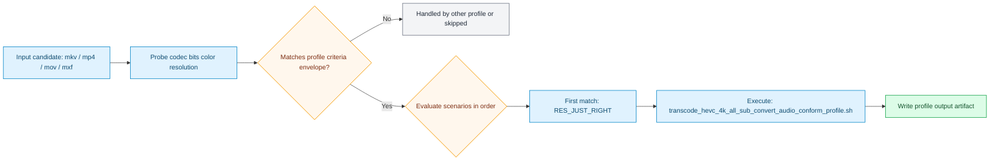

# Fire TV Family 4K All Subtitle Convert Audio Conform Profile

Generated from stock preset pack `fire-tv-family-all-sub-convert-audio-conform`.

## Dependencies

| Tool | Needed | Why |
| --- | --- | --- |
| `ffmpeg` | required | scenario execution, encode/transcode, and mux packaging |
| `ffprobe` | required | criteria probing and stream/metadata inspection |

## E2E Verification

This profile is considered e2e-verified when its mapped suites pass in CI.

| Suite | What it proves | Toolchain version report |
| --- | --- | --- |
| `tests/e2e/run_profile_actions_e2e.sh` | action-level output behavior, guardrails, and subtitle-intent pathways | `tests/e2e/.reports/latest/run_profile_actions_e2e_toolchain_versions.md` |

- Combined toolchain snapshot: [Latest E2E Toolchain Report](../../e2e-toolchain-latest.md)

## Input Envelope

| Field | Value |
| --- | --- |
| Codec | `any` |
| Bit depth | `any` |
| Color space | `any` |
| Min resolution | `1921x1081` |
| Max resolution | `3840x2160` |

## Scenario Map

| Scenario | Command |
| --- | --- |
| `RES_JUST_RIGHT` | `transcode_hevc_4k_all_sub_convert_audio_conform_profile.sh` |
| `ELSE` | `profile_guardrail_skip.sh (profile guardrail skip)` |

## Runtime Behavior

- Scenario `RES_JUST_RIGHT` uses action script `transcode_hevc_4k_all_sub_convert_audio_conform_profile.sh`.
- Scenario `ELSE` uses action script `profile_guardrail_skip.sh`.

Action summary from `transcode_hevc_4k_all_sub_convert_audio_conform_profile.sh`:

- Inherits the 4K HEVC encode path from the smart-English audio-conform action.
- Defaults subtitle behavior to `all_sub_preserve + subtitle_convert`.
- Text subtitles normalize to `mov_text` when MP4 remains viable.
- Bitmap subtitles fall back to MKV preservation by default.
- Preserves AAC and Dolby-family audio streams where already acceptable.
- Conforms DTS-family and PCM-family audio when needed.
- Supports the same bounded video-only `aggressive_vmaf` mode as the underlying HEVC lane.

Operator knobs from `transcode_hevc_4k_all_sub_convert_audio_conform_profile.sh`:

- `VFO_ENCODER_MODE=auto|hw|cpu`
- `VFO_MP4_STREAM_MODE=fmp4_faststart|fmp4|faststart`
- `VFO_SUBTITLE_SELECTION_SCOPE=all_sub_preserve`
- `VFO_SUBTITLE_MODE=subtitle_convert`
- `VFO_SUBTITLE_CONVERT_BITMAP_POLICY=preserve_mkv|fail`
- `VFO_QUALITY_MODE=standard|aggressive_vmaf`
- `SCRIPT_DIR="$(cd "$(dirname "$0")" && pwd)"`
- `export VFO_SUBTITLE_SELECTION_SCOPE="${VFO_SUBTITLE_SELECTION_SCOPE:-all_sub_preserve}"`
- `export VFO_SUBTITLE_MODE="${VFO_SUBTITLE_MODE:-subtitle_convert}"`
- `export VFO_SUBTITLE_CONVERT_BITMAP_POLICY="${VFO_SUBTITLE_CONVERT_BITMAP_POLICY:-preserve_mkv}"`

## Starting Inputs And Expected Outputs

| Aspect | What this profile expects / does |
| --- | --- |
| Starting containers | `mkv, mp4, mov, mxf (anything ffmpeg can demux)` |
| Required codec envelope | `any` / `any-bit` / `any` |
| Required resolution range | `1921x1081` to `3840x2160` |
| If criteria do not match | candidate is routed to another profile or skipped |
| If criteria match | scenario order is evaluated and first match executes |
| Output intent | profile-specific output written by selected scenario command |

## Flow

## Source

- Preset file: `services/vfo/presets/fire-tv-family-all-sub-convert-audio-conform/vfo_config.preset.conf`
- Generated by: `infra/scripts/generate-profile-docs.sh`
