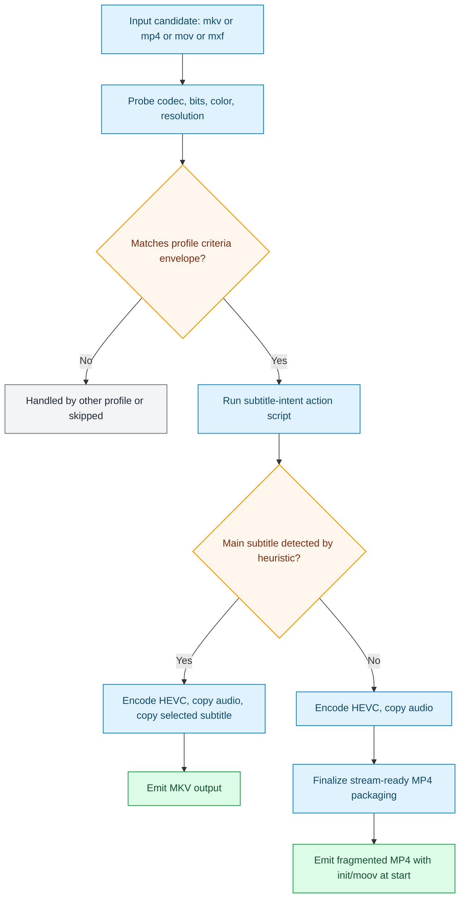

# netflixy_preserve_audio_main_subtitle_intent_1080p

Generated from stock preset pack `netflixy_main_subtitle_intent`.

## Input Envelope

| Field | Value |
| --- | --- |
| Codec | `any` |
| Bit depth | `any` |
| Color space | `bt709` |
| Min resolution | `352x240` |
| Max resolution | `1920x1080` |

## Scenario Map

| Scenario | Command |
| --- | --- |
| `RES_JUST_RIGHT COLOR_SPACE_JUST_RIGHT` | `transcode_hevc_1080_main_subtitle_preserve_profile.sh $vfo_input $vfo_output` |
| `ELSE` | `profile_guardrail_skip.sh $vfo_input $vfo_output netflixy_1080_guardrail_requires_sdr_bt709_and_1080p_or_lower_input` |

## Runtime Behavior

- Scenario `RES_JUST_RIGHT COLOR_SPACE_JUST_RIGHT` uses action script `transcode_hevc_1080_main_subtitle_preserve_profile.sh`.
- Scenario `ELSE` uses action script `profile_guardrail_skip.sh`.

Action summary from `transcode_hevc_1080_main_subtitle_preserve_profile.sh`:

- Always preserves audio streams with stream copy.
- Selects one "main subtitle" when it appears director-intent oriented:
-   priority: forced english -> forced untagged/unknown -> optional default english.
-   non-english forced tracks are intentionally skipped.
- If a main subtitle is selected, output container is MKV for reliable subtitle preservation.
- If no main subtitle is selected, output container is stream-ready MP4:
-   fragmented MP4 with init/moov at the start.

Operator knobs from `transcode_hevc_1080_main_subtitle_preserve_profile.sh`:

- `VFO_MAIN_SUBTITLE_INCLUDE_DEFAULT=1   # include default english subtitle when no forced track exists`
- `VFO_ENCODER_MODE=auto|hw|cpu`
- `VFO_MP4_STREAM_MODE=fmp4_faststart|fmp4|faststart`
- `default: fmp4_faststart`

## Starting Inputs And Expected Outputs

| Aspect | What this profile expects / does |
| --- | --- |
| Starting containers | `mkv, mp4, mov, mxf (anything ffmpeg can demux)` |
| Required codec envelope | `any` / `any-bit` / `bt709` |
| Required resolution range | `352x240` to `1920x1080` |
| If criteria do not match | candidate is routed to another profile or skipped |
| If criteria match | scenario order is evaluated and first match executes |
| Output intent | conditional: MKV when main subtitle intent is detected, otherwise stream-ready MP4 (fragmented + init/moov at start by default) |

## Flow

## Source

- Preset file: `services/vfo/presets/netflixy_main_subtitle_intent/vfo_config.preset.conf`
- Generated by: `infra/scripts/generate-profile-docs.sh`
