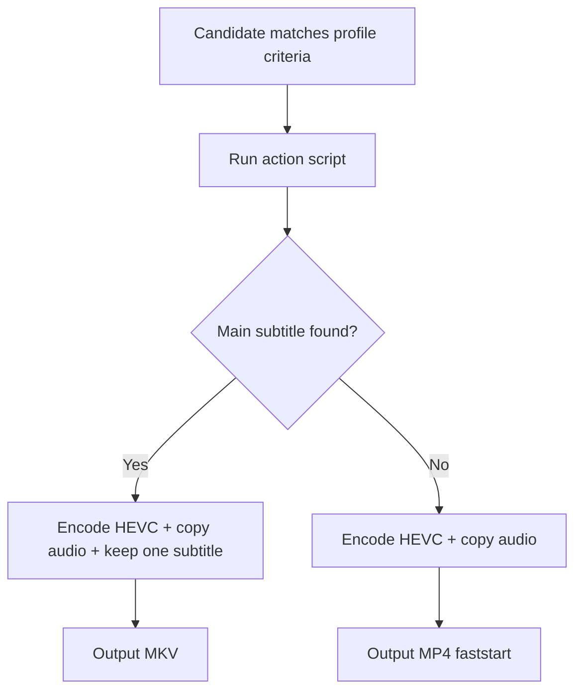

# netflixy_preserve_audio_main_subtitle_intent_1080p

Generated from stock preset pack `netflixy_main_subtitle_intent`.

## Input Envelope

| Field | Value |
| --- | --- |
| Codec | `h264` |
| Bit depth | `8` |
| Color space | `bt709` |
| Min resolution | `352x240` |
| Max resolution | `1920x1080` |

## Scenario Map

| Scenario | Command |
| --- | --- |
| `ELSE` | `transcode_hevc_1080_main_subtitle_preserve_profile.sh $vfo_input $vfo_output` |

## Runtime Behavior

- Scenario `ELSE` uses action script `transcode_hevc_1080_main_subtitle_preserve_profile.sh`.

Action summary from `transcode_hevc_1080_main_subtitle_preserve_profile.sh`:

- Always preserves audio streams with stream copy.
- Selects one "main subtitle" when it appears director-intent oriented:
-   priority: forced english -> forced untagged/unknown -> optional default english.
-   non-english forced tracks are intentionally skipped.
- If a main subtitle is selected, output container is MKV for reliable subtitle preservation.
- If no main subtitle is selected, output container is MP4 with +faststart.

## Flow

## Source

- Preset file: `services/vfo/presets/netflixy_main_subtitle_intent/vfo_config.preset.conf`
- Generated by: `infra/scripts/generate-profile-docs.sh`
