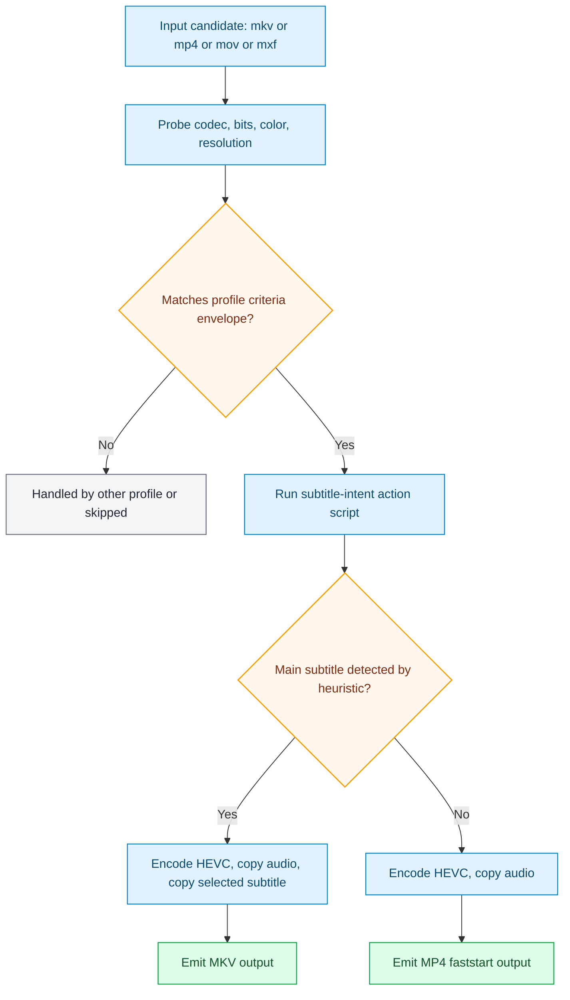

# netflixy_preserve_audio_main_subtitle_intent_4k

Generated from stock preset pack `netflixy_main_subtitle_intent`.

## Input Envelope

| Field | Value |
| --- | --- |
| Codec | `hevc` |
| Bit depth | `10` |
| Color space | `bt2020nc` |
| Min resolution | `1920x1080` |
| Max resolution | `3840x2160` |

## Scenario Map

| Scenario | Command |
| --- | --- |
| `ELSE` | `transcode_hevc_4k_main_subtitle_preserve_profile.sh $vfo_input $vfo_output` |

## Runtime Behavior

- Scenario `ELSE` uses action script `transcode_hevc_4k_main_subtitle_preserve_profile.sh`.

Action summary from `transcode_hevc_4k_main_subtitle_preserve_profile.sh`:

- Always preserves audio streams with stream copy.
- Selects one "main subtitle" when it appears director-intent oriented:
-   priority: forced english -> forced untagged/unknown -> optional default english.
-   non-english forced tracks are intentionally skipped.
- If a main subtitle is selected, output container is MKV for reliable subtitle preservation.
- If no main subtitle is selected, output container is MP4 with +faststart.

Operator knobs from `transcode_hevc_4k_main_subtitle_preserve_profile.sh`:

- `VFO_MAIN_SUBTITLE_INCLUDE_DEFAULT=1   # include default english subtitle when no forced track exists`
- `VFO_ENCODER_MODE=auto|hw|cpu`

## Starting Inputs And Expected Outputs

| Aspect | What this profile expects / does |
| --- | --- |
| Starting containers | `mkv, mp4, mov, mxf (anything ffmpeg can demux)` |
| Required codec envelope | `hevc` / `10-bit` / `bt2020nc` |
| Required resolution range | `1920x1080` to `3840x2160` |
| If criteria do not match | candidate is routed to another profile or skipped |
| If criteria match | scenario order is evaluated and first match executes |
| Output intent | conditional: MKV when main subtitle intent is detected, otherwise MP4 +faststart |

## Flow

## Source

- Preset file: `services/vfo/presets/netflixy_main_subtitle_intent/vfo_config.preset.conf`
- Generated by: `infra/scripts/generate-profile-docs.sh`
