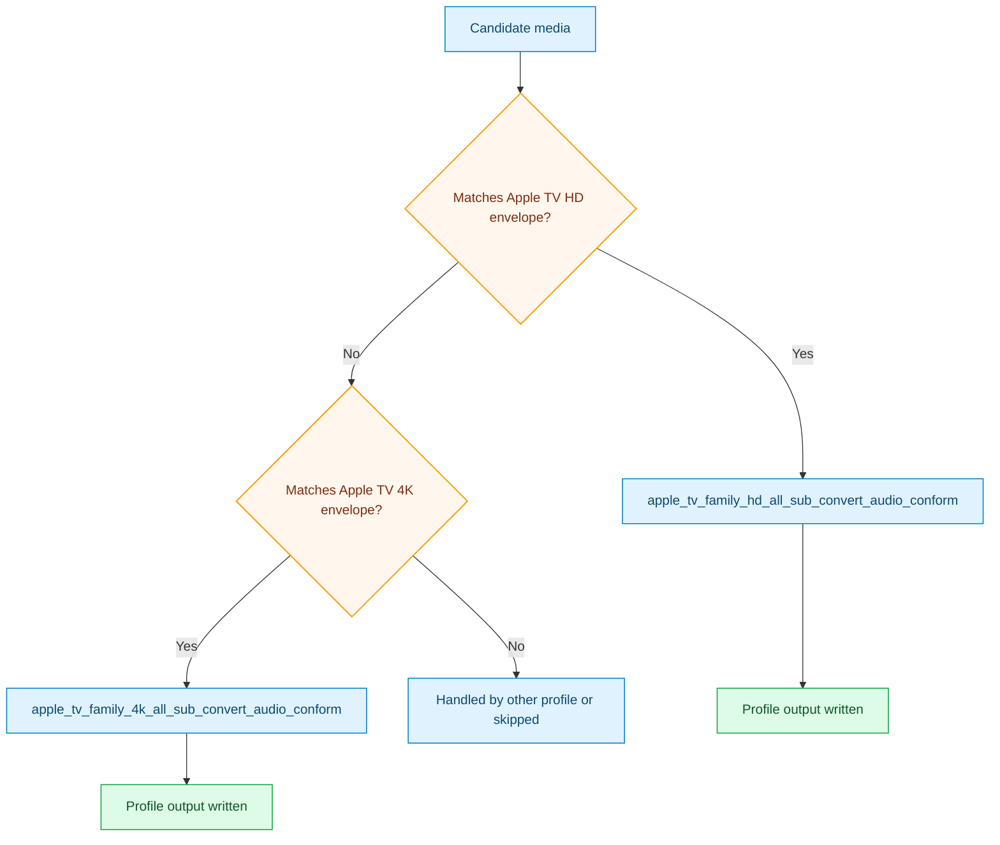

# Apple TV Family All Sub Convert Audio Conform Pack

This pack provides shared Apple TV HD and 4K delivery lanes with explicit
subtitle/audio handling.

## Outcome Target

- target Apple TV playback envelopes directly
- use H.264 for HD delivery and HEVC for 4K delivery
- keep all subtitles in scope while converting text subtitles when MP4-safe
  delivery is possible

## Focus

- Apple TV family-specific output envelopes
- fragmented MP4 preferred, MKV fallback when subtitle/audio safety requires it
- `audio_conform` for DTS-family and PCM-family sources
- optional video-only `aggressive_vmaf`

## Covered Device Baselines

| Profile | Current device baseline | Notes |
| --- | --- | --- |
| `apple_tv_family_hd_all_sub_convert_audio_conform` | Apple TV HD | Conservative HD baseline |
| `apple_tv_family_4k_all_sub_convert_audio_conform` | Apple TV 4K | Conservative UHD baseline |

## Included Profiles

- [apple_tv_family_hd_all_sub_convert_audio_conform](../generated/apple-tv-family-hd-all-sub-convert-audio-conform.md)
- [apple_tv_family_4k_all_sub_convert_audio_conform](../generated/apple-tv-family-4k-all-sub-convert-audio-conform.md)

## Pack Flow

