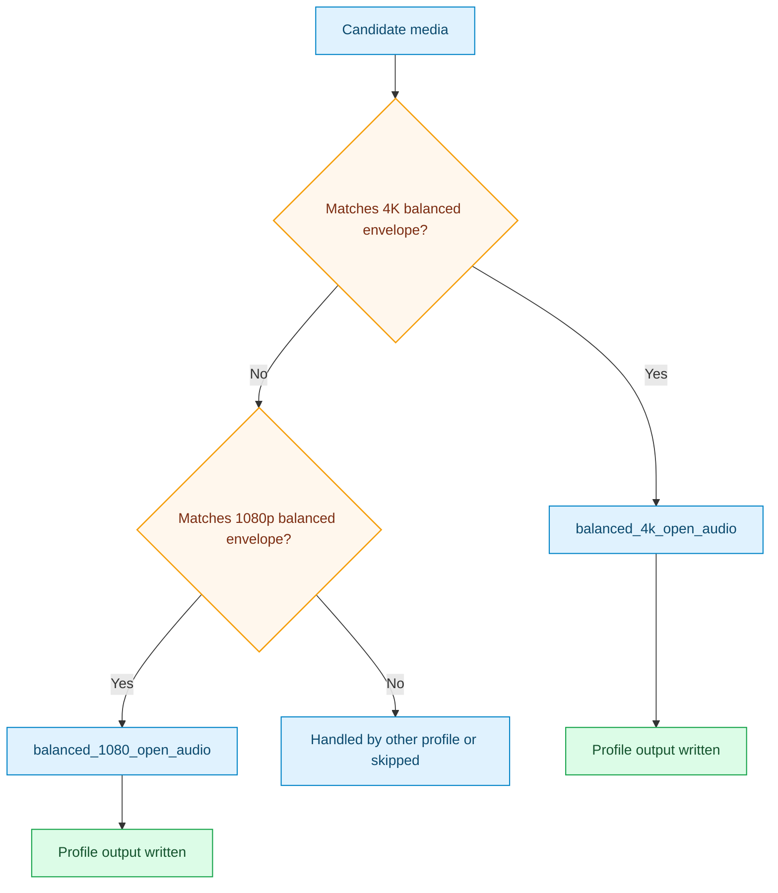

# Balanced Open Audio Pack

This pack provides simple baseline lanes for broad usage before device-specific tuning.

## Outcome Target

- produce consistent 4K/1080 outputs with low setup overhead
- keep audio handling open where possible
- provide a stable baseline before moving to stricter device-target packs

## Focus

- easy 4K and 1080p starter targets
- open audio stream strategy where possible
- straightforward criteria envelopes for quick setup

## Included Profiles

- [balanced_4k_open_audio](../generated/balanced-4k-open-audio.md)
- [balanced_1080_open_audio](../generated/balanced-1080-open-audio.md)

## Pack Flow

