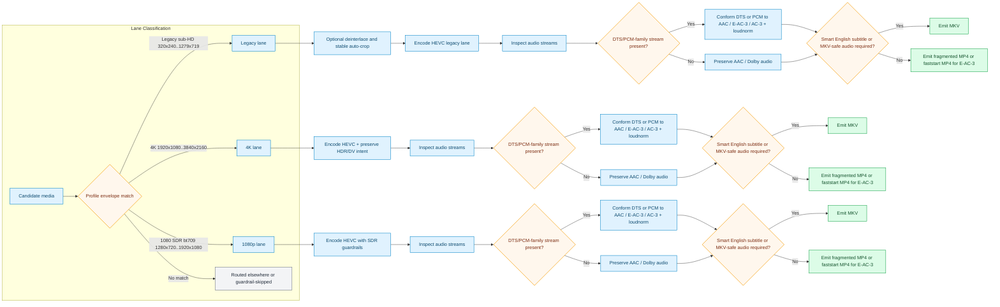

# Craigstreamy HEVC Smart Eng Sub Audio Conform Pack

This pack keeps the same subtitle-intent and HEVC posture as the existing craigstreamy preserve pack, but adds a stricter audio-delivery policy for DTS-family and PCM-family mezzanines.

## Intent

This pack standardizes mixed-library inputs into streaming-friendly HEVC outputs while:

- preserving smart English subtitle intent
- preserving AAC and Dolby-family audio streams when they are already acceptable
- conforming DTS-family and PCM-family audio into open-source Dolby-aligned delivery codecs
- using MKV whenever subtitle or preserved-audio safety requires it

## What It Optimizes For

- practical HEVC bitrate reduction across 4K, 1080p SDR, and legacy sub-HD lanes
- subtitle-intent-sensitive container branching
- preserve-first audio policy for already-acceptable streams
- DTS/PCM delivery cleanup without pretending we can author Atmos
- loudness normalization only on the audio streams we actually transcode

## Audio Conform Plans Of Attack

| Source audio shape | Plan |
| --- | --- |
| DTS or PCM mono / stereo | decode -> loudnorm -> AAC |
| DTS or PCM 3.0 / 4.0 / 5.0 / 5.1 | decode -> loudnorm -> E-AC-3 when available, else AC-3 |
| DTS 7.x / DTS:X style high-channel renders or PCM > 5.1 | decode/render -> downmix to 5.1 -> loudnorm -> E-AC-3 when available, else AC-3 |
| AAC / AC-3 / E-AC-3 / TrueHD | preserve as-is |
| Preserved stream not suitable for MP4 | keep MKV instead of forcing unnecessary audio rewrite |

## High-Level Assessments

| Label | Assessment |
| --- | --- |
| Dynamic range | `HDR/DV aware` on 4K, SDR-gated on 1080p, broad intake on legacy sub-HD |
| Resolution | `4K / 1080p / legacy sub-HD` lane family |
| Audio codecs | `AAC + Dolby preserve`, `DTS/PCM conform` |
| Video codecs | `HEVC transcode target` |
| Interlacing | `legacy lane only; optional deinterlace` |
| Volume normalisation | `applied when DTS/PCM-family audio is transcoded` |
| Crop | `legacy lane auto-crop enabled` |
| Lowered video bitrate | `yes` |
| Lowered audio bitrate | `not as a general policy; only codec-target defaults for DTS/PCM conform` |
| Audio transcoded | `DTS/PCM-family only` |
| Video transcoded | `yes` |
| Audio switched | `DTS/PCM -> AAC / E-AC-3 / AC-3 when needed` |
| Subtitle retained | `smart English subtitle intent` |
| Subtitle transformed | `no; retain/preserve intent only` |
| Container changed | `yes when subtitle or preserved-audio safety requires MKV; otherwise fragmented MP4 with faststart fallback for E-AC-3` |
| Container targets | `MKV` / `fragmented MP4` |
| Bitrate targets | `practical video efficiency; audio preserve-first` |
| Audio bitrate targets | `codec-target defaults only when DTS/PCM-family audio is conformed` |
| Overall bitrate targets | `reduce video bitrate while preserving viewing intent and sane audio delivery` |
| Error | `guardrail skip, missing toolchain, strict DV/HDR mismatch, or unknown error placeholder` |

## Included Profiles

- [craigstreamy_hevc_smart_eng_sub_audio_conform_4k](../generated/craigstreamy-hevc-smart-eng-sub-audio-conform-4k.md)
- [craigstreamy_hevc_smart_eng_sub_audio_conform_1080p](../generated/craigstreamy-hevc-smart-eng-sub-audio-conform-1080p.md)
- [craigstreamy_hevc_smart_eng_sub_audio_conform_legacy_subhd](../generated/craigstreamy-hevc-smart-eng-sub-audio-conform-legacy-subhd.md)

## Pack Flow

## What This Pack Does Not Do

- It does not invent Atmos or proprietary immersive metadata.
- It does not transcode already-acceptable AAC or Dolby-family streams just to make everything uniform.
- It does not apply a broad audio bitrate-lowering strategy yet.
- It does not OCR or convert bitmap subtitles to text subtitles.
- It does not semantically understand subtitle meaning; subtitle selection uses metadata/flag heuristics.
- It does not generate ABR ladders (HLS/DASH); outputs are single-file delivery artifacts.
- It depends on source integrity and toolchain support for DV/HDR retention; strict mode may fail instead of silently downgrading.
