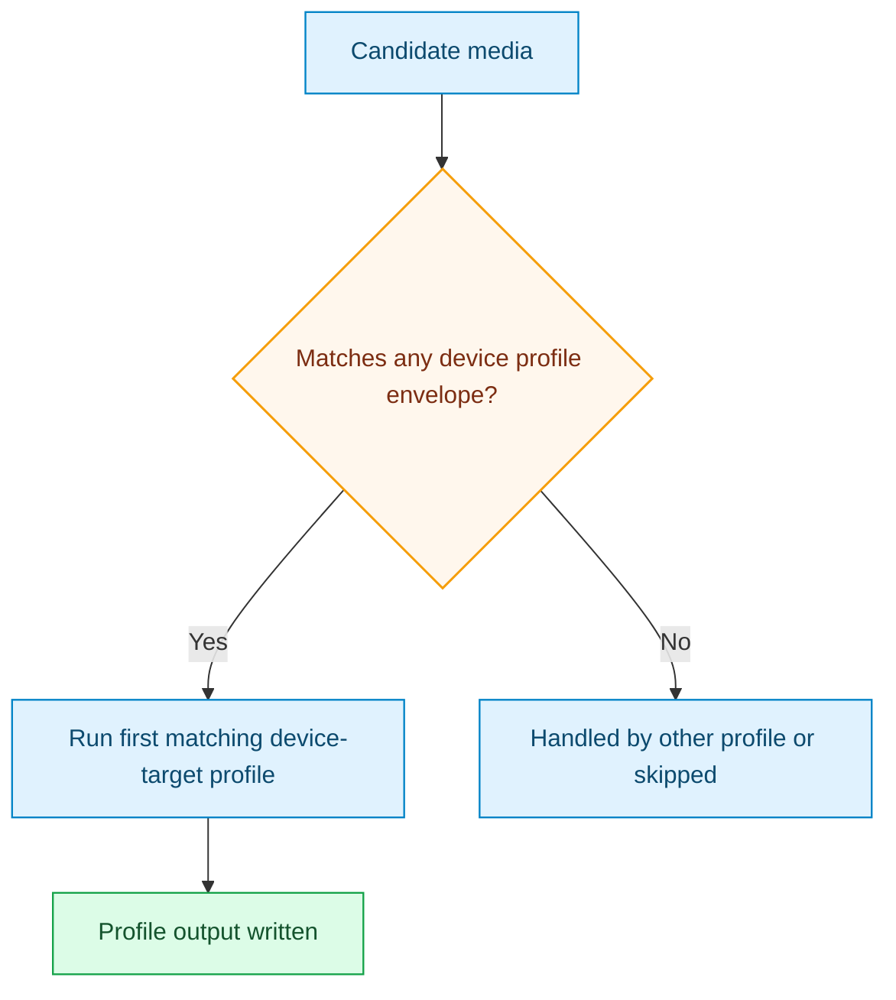

# Device Targets Open Audio Pack

Legacy compatibility pack.

This pack provides the older compatibility-shaped profiles for common streaming devices.

## Outcome Target

- maximize practical playback success on mainstream devices
- keep output envelopes explicit per device family
- preserve audio flexibility while remaining compatibility-first
- remain available for compatibility while the newer explicit family packs take over as the clearer default

## Focus

- device-oriented criteria envelopes (Roku, Fire TV, Chromecast, Apple TV)
- compatibility-first packaging approach
- open audio stream strategy where possible
- explicit SDR-target fallback on the 1080 H.264 lane when PQ/HLG inputs arrive without the full HDR tonemap filter stack
- superseded by:
  - `roku_family_all_sub_convert_audio_conform`
  - `fire_tv_family_all_sub_convert_audio_conform`
  - `chromecast_google_tv_family_all_sub_convert_audio_conform`
  - `apple_tv_family_all_sub_convert_audio_conform`
  - `fire_tv_stick_4k_dv_all_sub_convert_audio_conform`

## Included Profiles

- [roku_express_1080_open_audio](../generated/roku-express-1080-open-audio.md)
- [roku_4k_open_audio](../generated/roku-4k-open-audio.md)
- [fire_tv_stick_lite_1080_open_audio](../generated/fire-tv-stick-lite-1080-open-audio.md)
- [fire_tv_stick_4k_open_audio](../generated/fire-tv-stick-4k-open-audio.md)
- [fire_tv_stick_4k_max_open_audio](../generated/fire-tv-stick-4k-max-open-audio.md)
- [fire_tv_stick_4k_dv_open_audio](../generated/fire-tv-stick-4k-dv-open-audio.md)
- [chromecast_google_tv_hd_open_audio](../generated/chromecast-google-tv-hd-open-audio.md)
- [chromecast_google_tv_4k_open_audio](../generated/chromecast-google-tv-4k-open-audio.md)
- [apple_tv_hd_open_audio](../generated/apple-tv-hd-open-audio.md)
- [apple_tv_4k_open_audio](../generated/apple-tv-4k-open-audio.md)

## Pack Flow

