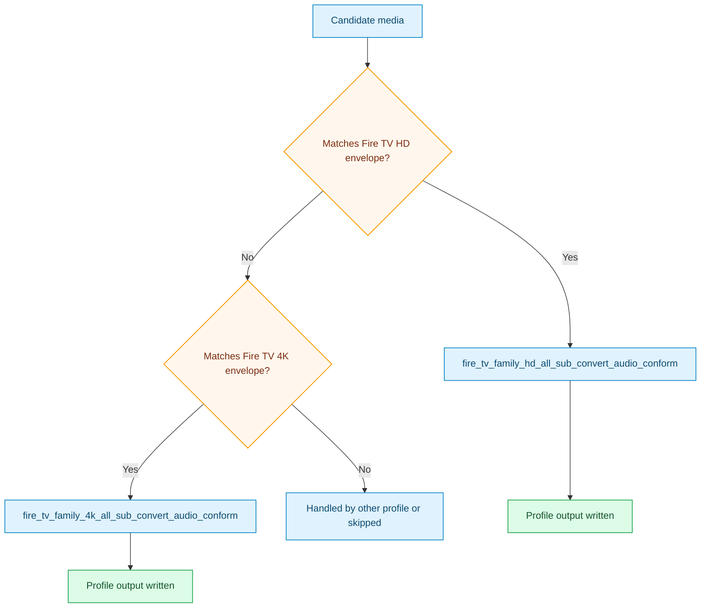

# Fire TV Family All Sub Convert Audio Conform Pack

This pack provides shared Fire TV HD and 4K lanes with explicit subtitle/audio
delivery behavior.

## Outcome Target

- target Fire TV family playback envelopes directly
- use H.264 for HD delivery and HEVC for 4K delivery
- keep all subtitles visible in policy terms, but convert text subtitles when
  MP4-safe delivery is available

## Focus

- Fire TV family-specific output envelopes
- fragmented MP4 preferred, MKV fallback when subtitle/audio safety requires it
- `audio_conform` for DTS-family and PCM-family sources
- optional video-only `aggressive_vmaf`

## Included Profiles

- [fire_tv_family_hd_all_sub_convert_audio_conform](../generated/fire-tv-family-hd-all-sub-convert-audio-conform.md)
- [fire_tv_family_4k_all_sub_convert_audio_conform](../generated/fire-tv-family-4k-all-sub-convert-audio-conform.md)

## Pack Flow

