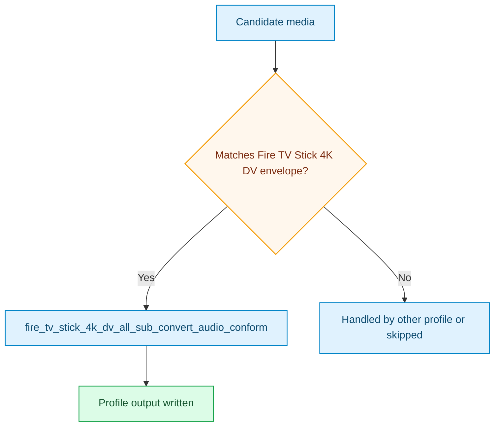

# Fire TV Stick 4K DV All Sub Convert Audio Conform Pack

This pack provides the explicit Dolby Vision-capable Fire TV Stick 4K lane.

## Outcome Target

- target the Fire TV Stick 4K DV playback envelope directly
- use HEVC 4K with DV retention when the toolchain can keep it
- keep all subtitles in scope while converting text subtitles when MP4-safe
  delivery still remains viable

## Focus

- Fire TV Stick 4K DV-specific output envelope
- fragmented MP4 preferred, MKV fallback when subtitle/audio safety requires it
- `audio_conform` for DTS-family and PCM-family sources
- standard quality mode today so DV handling remains predictable

## Covered Device Baseline

| Profile | Current device baseline | Notes |
| --- | --- | --- |
| `fire_tv_stick_4k_dv_all_sub_convert_audio_conform` | Fire TV Stick 4K Dolby Vision-capable lane | Explicit DV-oriented device lane, kept separate from the broader Fire TV family pack |

## Included Profiles

- [fire_tv_stick_4k_dv_all_sub_convert_audio_conform](../generated/fire-tv-stick-4k-dv-all-sub-convert-audio-conform.md)

## Pack Flow

