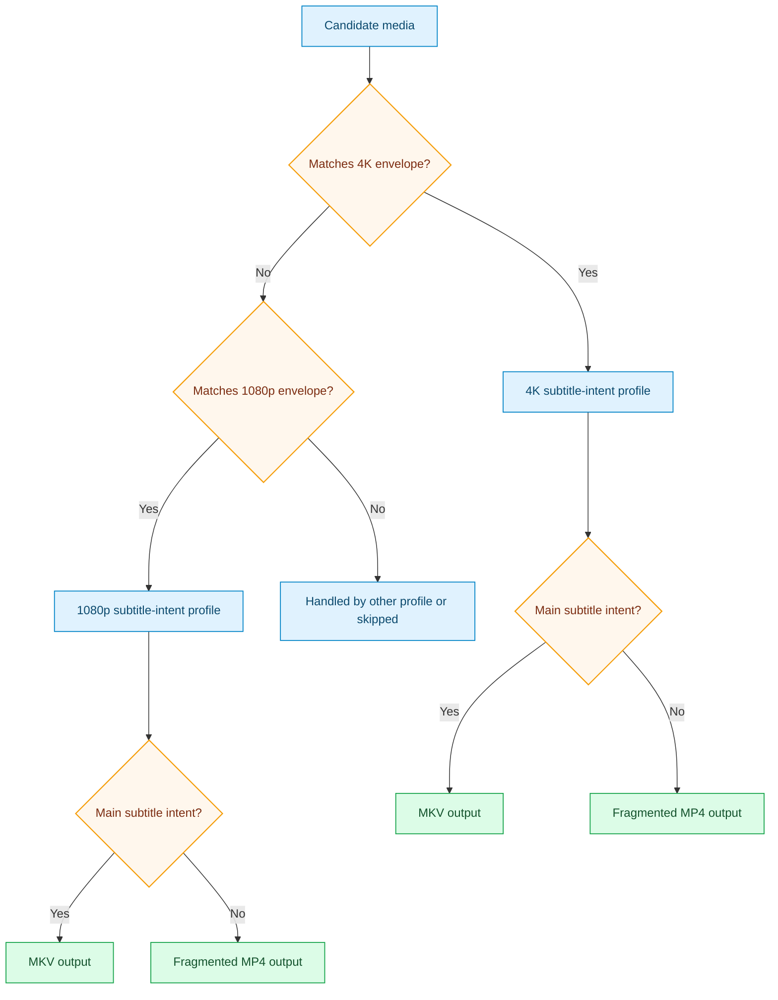

# Netflixy Main Subtitle Intent Pack

This pack targets practical streaming efficiency while preserving viewer-intent essentials.

## Outcome Target

- reduce bitrate with Netflix-like practical intent
- preserve full audio set and director-intent "main subtitle" behavior
- emit container type by viewing-intent need: MKV when subtitle intent applies, fragmented MP4 otherwise

## Focus

- preserve all audio streams
- preserve one "main subtitle" when it appears director-intent oriented
- when subtitle intent is present, emit MKV for robust subtitle compatibility
- when subtitle intent is absent, emit stream-ready MP4 (fragmented + init/moov-at-start by default)

## Included Profiles

- [netflixy_preserve_audio_main_subtitle_intent_4k](../generated/netflixy-preserve-audio-main-subtitle-intent-4k.md)
- [netflixy_preserve_audio_main_subtitle_intent_1080p](../generated/netflixy-preserve-audio-main-subtitle-intent-1080p.md)

## Pack Flow

