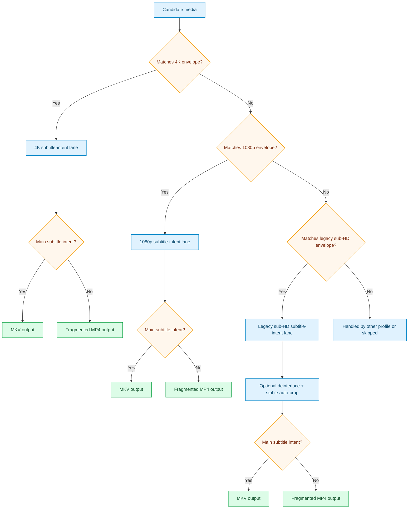

# Netflixy Main Subtitle Intent Pack

This pack targets practical streaming efficiency while preserving viewer-intent essentials.

## Intent

This pack standardizes mixed-library inputs into streaming-friendly HEVC outputs while preserving mainline viewing intent.

- preserve full audio when possible
- preserve director-intended english "main subtitle" behavior when detected
- use MKV when subtitle intent applies, otherwise emit stream-ready fragmented MP4

## What It Optimizes For

- practical "netflixy" bitrate reduction posture
- consistent HEVC delivery across 4K, 1080p SDR, and legacy sub-HD lanes
- audio preservation first, without forcing broad audio transcoding
- subtitle-intent-sensitive container selection
- optional legacy remediation (deinterlace + stable black-bar crop) in the sub-HD lane

## Guardrails

- 1080 profile lane is SDR-gated (`bt709`) in the 1280x720..1920x1080 envelope.
- 4K profile lane accepts SDR or HDR candidates in the configured 1920x1080..3840x2160 envelope.
- Legacy sub-HD profile lane accepts broad codec/color intake in the 320x240..1279x719 envelope.
- Codec intake is broad across lanes (`any`), so HEVC, H.264 (including rare 10-bit), AV1, VP9, and legacy MPEG-2 style mezzanines can be processed.
- Guardrail misses are written as `*.guardrail_skipped.txt` markers by `profile_guardrail_skip.sh`.

## Focus

- preserve all audio streams
- preserve one "main subtitle" when it appears director-intent oriented
- when subtitle intent is present, emit MKV for robust subtitle compatibility
- when subtitle intent is absent, emit stream-ready MP4 (fragmented + init/moov-at-start by default)
- for legacy sub-HD lane: optional interlace-aware deinterlace + stable black-bar auto-crop

## Included Profiles

- [netflixy_preserve_audio_main_subtitle_intent_4k](../generated/netflixy-preserve-audio-main-subtitle-intent-4k.md)
- [netflixy_preserve_audio_main_subtitle_intent_1080p](../generated/netflixy-preserve-audio-main-subtitle-intent-1080p.md)
- [netflixy_preserve_audio_main_subtitle_intent_legacy_subhd](../generated/netflixy-preserve-audio-main-subtitle-intent-legacy-subhd.md)

## Pack Flow

## What This Pack Does Not Do

- It does not normalize frame rate; source cadence/timebase is preserved by default.
- It does not transcode audio for target-device compatibility by default.
- It does not guarantee every mezzanine audio codec can be muxed into every output container.
- It does not semantically understand subtitle meaning; subtitle selection uses metadata/flag heuristics.
- It does not OCR or convert bitmap subtitles to text subtitles.
- It does not generate ABR ladders (HLS/DASH); outputs are single-file delivery artifacts.
- It does not certify playback on every device model; profiles are compatibility-oriented guardrails.
- It does not enforce PSNR/SSIM/VMAF thresholds unless quality checks are explicitly enabled and configured.
- It does not invent missing HDR/DV essence; metadata repair is heuristic and can be disabled.
- It depends on source integrity and toolchain support for DV/HDR retention; strict mode may fail instead of silently downgrading.
