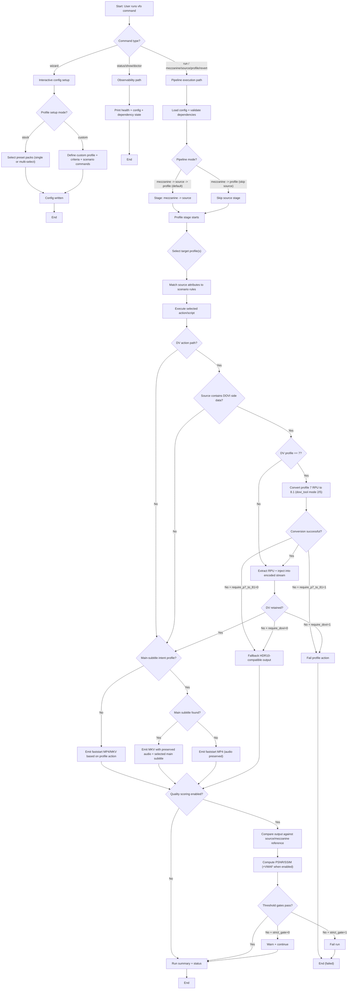

# vfo Workflow Engine Progression

This map describes how vfo progresses through runtime selections, pipeline branches, and stage outcomes.

Formal model artifacts:

- BPMN: `services/vfo/docs/workflow-engine.bpmn`
- DMN: `services/vfo/docs/workflow-decisions.dmn`
- Local visualization report: `vfo visualize` (see `services/vfo/docs/workflow-visualization.md`)

## Camunda-style progression map

## Selection-driven use cases

- Library normalization first:
  - choose default mode `mezzanine -> source -> profile`
  - use when source layer standardization is part of your workflow
- Direct delivery generation:
  - choose `mezzanine -> profile`
  - use when mezzanine is already normalized and you want speed
- Device compatibility:
  - select device target stock profiles (`roku_*`, `fire_tv_*`, `chromecast_*`, `apple_tv_*`)
  - conformance checks validate codec/resolution/audio boundaries in E2E
- Subtitle intent preservation:
  - use `craigstreamy_hevc_selected_english_subtitle_preserve_*` profiles
  - forced/default english subtitle intent drives MKV vs MP4 container branch
- DV profile 7 source handling:
  - `transcode_hevc_4k_dv_profile.sh` now converts profile 7 metadata to 8.1 before injection
  - strict controls can fail run if conversion or retention is not achieved
